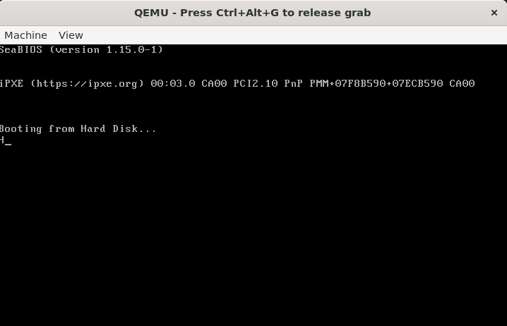

# Wave Testing

A website that shows the results of testing elements in the test/directory of the Wave repository.

---

## 

---

## `test.wave` (❌)


```wave
fun main() {
    var a: i32 = 10;
    var b: f32 = 3.14;
    println("Hello World {}");
    if (a == 10) {
        println("fwf");
    } else if (a > 10) {
        println("fef");
    } else {
        println("ewe");
    }

    for (i :i32 = 0; i <= 10; i++) {
        var j :i32 = 0;
        while (j <= 10) {
            println("{}", j);
            j++;
        }
    }

}
```

```text
Error: Expected 1 arguments, found 0
❌ Failed to parse function

thread 'main' panicked at src/runner.rs:17:34:
Failed to parse Wave code
note: run with `RUST_BACKTRACE=1` environment variable to display a backtrace
```

---

## `test2.wave` (✔)

```wave
fun main() {
    println("Hello World");
}
```

```text
Hello World
```

---

## `test3.wave` (❌)

```wave
import("iosys");

fun main() {
    let a :i32 = 10;
    var b :i32 = 5;
    println("Hello World");
}
```

```text
error: Could not find import target 'iosys.wave'
  --> iosys.wave:0:0
   |
   | (source unavailable)
```

---

## `test4.wave` (✔)

```wave
fun main() {
    var a :i8 = 4;
    var b :i64 = 2341324;
    var c :i128 = 3;
    var d :i1024 = 2342342;
    println("a = {}", a);
    println("b = {}", b);
    println("c = {}", c);
    println("d = {}", d);
}
```

```text
a = 4
b = 2341324
c = 3
d = 2342342
```

---

## `test5.wave` (✔)

```wave
fun main() {
    var a: i32 = 10;
    if (a == 10) {
        println("fwf");
    } else if (a > 10) {
        println("fef");
    } else {
        println("ewe");
    }
}
```

```text
fwf
```

---

## `test6.wave` (✔)

```wave
fun main() {
    var a :i8 = 4;
    var b :i64 = 2341324;
    var c :i128 = 3;
    var d :i1024 = 2342342;
    println("a = {}", a + a);
    println("b = {}", b + b);
    println("c = {}", c + c);
    println("d = {}", d + d);
}
```

```text
a = 8
b = 4682648
c = 6
d = 4684684
```


## `test7.wave` (✔)

```wave
fun main() {
    var a :i32 = 20;
    var b :i32 = 20;

    if (a > 30) {
        println("a is greater than 30");
    } else {
        println("a is less than or equal to 30");
    }

    if (b < a) {
        println("b is less than a");
    } else if (b == a) {
        println("b is equal to a");
    } else {
        println("b is greater than a");
    }

}
```

```text
a is less than or equal to 30
b is equal to a
```

---

## `test8.wave` (✔)

```wave
fun main() {
    var a: i32 = 10;
    var b: i32 = 50;

    if (a > 30) {
        println("a is greater than 30");
    } else {
        println("a is less than or equal to 30");
    }

    if (b > 30) {
        println("b is greater than 30");
    } else {
        println("b is less than or equal to 30");
    }
}
```

```text
a is less than or equal to 30
b is greater than 30
```

---

## `test9.wave` (✔)

```wave
fun main() {
    var a: i32 = 35;
    var b: i32 = 15;
    var c: i32 = 5;

    if (a == b) {
        println("a == b");
    } else {
        println("a != b");
    }

    if (a > b) {
        println("a > b");
    } else {
        println("a <= b");
    }

    if (a < b) {
        println("a < b");
    } else {
        println("a >= b");
    }

    if (a == c) {
        println("a == c");
    } else {
        println("a != c");
    }

    if (a > c) {
        println("a > c");
    } else {
        println("a <= c");
    }

    if (a < c) {
        println("a < c");
    } else {
        println("a >= c");
    }

    if (b == c) {
        println("b == c");
    } else {
        println("b != c");
    }

    if (b > c) {
        println("b > c");
    } else {
        println("b <= c");
    }

    if (b < c) {
        println("b < c");
    } else {
        println("b >= c");
    }

    if (a == a) {
        println("a == a");
    } else {
        println("a != a");
    }

    if (b == b) {
        println("b == b");
    } else {
        println("b != b");
    }

    if (c == c) {
        println("c == c");
    } else {
        println("c != c");
    }
}
```

```text
a != b
a > b
a >= b
a != c
a > c
a >= c
b != c
b > c
b >= c
a == a
b == b
c == c
```

---

## `test10.wave` (❌)

```wave
fun main() {
    var a: i32 = 15;
    var b: i32 = 40;
    var c: i32 = 30;

    if (a <= b) {
        if (b <= c) {
            println("{}", a);
            println("{}", b);
            println("{}", c);
        } else {
            if (a <= c) {
                println("{}", a);
                println("{}", c);
                println("{}", b);
            } else {
                println("{}", c);
                println("{}", a);
                println("{}", b);
            }
        }
    } else {
        if (a <= c) {
            println("{}", b);
            println("{}", a);
            println("{}", c);
        } else {
            if (b <= c) {
                println("{}", b);
                println("{}", c);
                println("{}", a);
            } else {
                println("{}", c);
                println("{}", b);
                println("{}", a);
            }
        }
    }
}
```

```text
Segmentation fault (core dumped)
```

---

## `test11.wave` (✔)

```wave
fun main() {
    var i: i32 = 1;

    while (i <= 5) {
        var j: i32 = 1;

        while (j <= i) {
            print("*");
            j = j + 1;
        }

        println(" ");
        i = i + 1;
    }
}
```

```text
* 
**
***
****
*****
```

---

## `test12.wave` (❌)

```wave
fun main(q :i32 = 0; w :i32 = 10;) {
    var a :str = "World";
    var b :i32 = 2;
    var c :i32 = 3;
    println("Hello {} {} {}", a, q, w);
}
```

```text
Hello World 1 1289217416
```

---

## `test13.wave` (✔)

```wave
fun main() {
    var numbers: array<i32, 5> = [1, 2, 3, 4, 5];
    println("First = {}", numbers[0]);
}
```

```text
First = 1
```

---

## `test14.wave` (✔)

```wave
fun hello(name :i32; namea :i32; nameb :str;) {
    if (name > 10) {
        println("name is greater than 10");
    } else {
        println("name is 10 or less");
    }

    var counter: i32 = 0;

    while (counter < name) {
        println("Current: {}", counter);
        counter = counter + 1;
    }

    println("Hello {}", name);
    println("Hello {}", namea);
    println("Hello {}", nameb);
}

fun main() {
    hello(5, 2, "World");
}
```

```text
name is 10 or less
Current: 0
Current: 1
Current: 2
Current: 3
Current: 4
Hello 5
Hello 2
Hello World
```

---

## `test15.wave` (✔)

```wave
fun add(a :i32; b :i32;) -> i32 {
    return a + b;
}

fun main() {
    println("{}", add(4, 5));
}
```

```text
9
```

---

## `test16.wave` (✔)

```wave
fun main() {
    var i: i32 = 0;

    while (i < 5) {
        i = i + 1;
        if (i == 3) {
            continue;
        }
        println("Value: {}", i);
    }
}
```

```text
Value: 1
Value: 2
Value: 4
Value: 5
```

---

## `test17.wave` (❌)

```wave
fun add(a: i32; b: i32) -> i32 {
    return a + b;
}

fun complex(x: i32; y: i32; msg: str; sum: i32) {
    println("START COMPLEX FUNCTION");

    if (x > y) {
        println("{} is greater than {}", x, y);
        var cnt: i32 = 0;
        while (cnt < x) {
            if (cnt == 2) {
                cnt = cnt + 1;
                continue;
            }
            println("Loop1 cnt: {}", cnt);
            cnt = cnt + 1;
        }
    } else {
        println("{} is less than or equal to {}", x, y);
    }

    var i: i32 = 1;
    while (i <= 5) {
        var j: i32 = 1;
        while (j <= i) {
            print("*");
            j = j + 1;
        }
        println(" ");
        i = i + 1;
    }

    println("Sum from main: {}", sum);
    println("Message: {}", msg);
    println("END COMPLEX FUNCTION");
}

fun main() {
    var a: i32 = 5;
    var b: i32 = 10;

    var small: i32 = 3;
    var big: i32 = 100000;
    var huge: i32 = 5000;
    var insane: i32 = 999999;

    println("Types: {} {} {} {}", small, big, huge, insane);

    if (a == b) {
        println("{} == {}", a, b);
    } else if (a > b) {
        println("{} > {}", a, b);
    } else {
        println("{} < {}", a, b);
    }

    if (a <= b) {
        if (b <= 30) {
            println("{} <= 30", b);
        } else {
            println("{} > 30", b);
        }
    }

    var result :i32;
    result = add(a, b);

    println("add({}, {}) = {}", a, b, result);

    complex(a, b, "Hello From Wave!", result);

    println("END MAIN FUNCTION");
}
```

```text
Segmentation fault (core dumped)
```

---

## `test18.wave` (✔)

```wave
fun add(a :i32; b :i32;) -> i32 {
    return a + b;
}

fun main() {
    var result: i32;
    result = add(4, 5);
    println("{}", result);
}
```

```text
9
```

---

## `test19.wave` (✔)

```wave
fun add(a :i32; b :i32;) -> i32 {
    return a + b;
}

fun main() {
    var a :i32 = 1;
    var b :i32 = 2;
    var result: i32;
    result = add(a, b);
    println("{}", result);
}
```

```text
3
```

---

## `test19.wave` (✔)

```wave
fun add(a :i32; b :i32;) -> i32 {
    return a + b;
}

fun main() {
    var a :i32 = 1;
    var b :i32 = 2;
    var result: i32;
    result = add(a, b);
    println("{}", result);
}
```

```text
3
```

---

## `test20.wave` (✔)

```wave
fun fibonacci(n: i32) -> i32 {
    if (n == 0) {
        return 0;
    }

    if (n == 1) {
        return 1;
    }

    var prev :i32 = 0;
    var curr :i32 = 1;
    var next :i32;
    var i :i32 = 2;

    while (i <= n) {
        next = prev + curr;
        prev = curr;
        curr = next;
        i = i + 1;
    }

    return curr;
}

fun main() {
    var i :i32 = 0;
    var result :i32;

    while (i <= 10) {
        result = fibonacci(i);
        println("fibonacci({}) = {}", i, result);
        i = i + 1;
    }

    println("END FIBONACCI");
}
```

```text
fibonacci(0) = 0
fibonacci(1) = 1
fibonacci(2) = 1
fibonacci(3) = 2
fibonacci(4) = 3
fibonacci(5) = 5
fibonacci(6) = 8
fibonacci(7) = 13
fibonacci(8) = 21
fibonacci(9) = 34
fibonacci(10) = 55
END FIBONACCI
```

---

## `test21.wave` (❌)

```wave
import("iosys");

fun main() {
    println("{}", ((0b110111010) & 0x1FF));
}
```

```text
Error: Expected ')'
Error: Failed to parse expression in 'println'
❌ Failed to parse function

thread 'main' panicked at src/runner.rs:17:34:
Failed to parse Wave code
note: run with `RUST_BACKTRACE=1` environment variable to display a backtrace
```

---

## `test22.wave` (❌)

```wave
import("iosys");

fun hello() {
    var a: i32 = 0;
    println("hello world");
}

fun main() {
    var i: i32 = 1;
    var j: i32 = 1;
    var num: i32;

    var n: i32 = 3;

    if (n > 5) {
        println("5보다 큽니다.");
    } else {
        println("5보다 작습니다.");
    }

    input("{}", num);

    while (i <= num) {
        j = num;
        while (j >= i) {
            println("*");
            j--;
        }
        println("\n");
        i++;
    }

    hello();
}
```

```text
Error: Expected primary expression, found Input
Error: Expected primary expression, found "input"
Error: Expected primary expression, found 21
Error: Expected ')'
Error: Expected primary expression, found Rparen
Error: Expected primary expression, found ")"
Error: Expected primary expression, found 21
Error: Unexpected token, cannot start a statement with: Decrement
Error: Failed to parse statement inside block.
Error: Failed to parse statement inside block.
❌ Failed to parse function

thread 'main' panicked at src/runner.rs:17:34:
Failed to parse Wave code
note: run with `RUST_BACKTRACE=1` environment variable to display a backtrace
```

---

## `test23.wave` (✔)

```wave
fun main() {
    var x: i32 = 10;
    var p: ptr<i32> = &x;

    println("x = {}", x);
    println("p = {}", deref p);
    println("address = {}", p);
}
```

```text
x = 10
p = 10
address = 140731088797956
```

---

## `test24.wave` (❌)

```wave
fun main() {
    var a: i32 = 10;
    var b: i32 = 20;

    var p1: ptr<i32> = &a;
    var p2: ptr<i32> = &b;

    println("Before:");
    println("a = {}, b = {}", a, b);
    println("p1 = {}, p2 = {}", deref p1, deref p2);

    var temp: i32 = deref p1;
    deref p1 = deref p2;
    deref p2 = temp;

    println("After:");
    println("a = {}, b = {}", a, b);
    println("p1 = {}, p2 = {}", deref p1, deref p2);
}
```

```text

```

---

## `test25.wave` (✔)

```wave
fun make_http_get(host: str; path: str) {
    println("GET {} HTTP/1.0", path);
    println("Host: {}", host);
    println("User-Agent: WaveLang/0.0.1");
    println(" ");
}

fun main() {
    make_http_get("example.com", "/index.html");
}
```

```text
GET /index.html HTTP/1.0
Host: example.com
User-Agent: WaveLang/0.0.1
```

---

## `test26.wave` (❌)

```wave
fun main(q :i32 = 0; w :i32 = 10;) {
    var a :str = "World";
    let b :i32 = 2;
    let mut c :i32 = 3;
    println("Hello {} {} {} {} {}", a, b, c, q, w);
}
```

```text
Hello World 2 3 1 1751909144
```

---

## `test27.wave` (❌)

```wave
fun main(name: str = "World") {
    println("Hello {}", name);
}
```

```text

```

---

## `test28.wave` (✔)

### `math.wave`

```wave
fun add(a: i32; b: i32) -> i32 {
    return a + b;
}

fun sub(a: i32; b: i32) -> i32 {
    return a - b;
}

fun mul(a: i32; b: i32) -> i32 {
    return a * b;
}

fun div(a: i32; b: i32) -> i32 {
    return a / b;
}
```

### `main.wave`

```wave
import("math");

fun main() {
    println("2 + 3 = {}", add(2, 3));
    println("2 - 3 = {}", sub(2, 3));
    println("2 * 3 = {}", mul(2, 3));
    println("2 / 3 = {}", div(2, 3));
}
```

```text
2 + 3 = 5
2 - 3 = -1
2 * 3 = 6
2 / 3 = 0
```

---

## `test29.wave` (✔)

```wave
fun main() {
    println("안녕, 세상!");
}
```

```text
안녕, 세상!
```

---

## `test30.wave` (✔)

```wave
fun main() {
    var msg_ptr: ptr<i8> = "Hello from syscall!\n";
    var ret_val: i64;

    asm {
        "mov rax, 1"
        "syscall"
        in("rdi") 1
        in("rsi") msg_ptr
        in("rdx") 20
        out("rax") ret_val
    }
}
```

```text
Hello from syscall!
```

---

## `test31.wave` (✔)

```wave
fun main() {
    var a: i32 = 10;
    var b: i32 = 20;

    var p1: ptr<i32> = &a;
    var p2: ptr<i32> = &b;
    var pp1: ptr<ptr<i32>> = &p1;
    var pp2: ptr<ptr<i32>> = &p2;

    println("a = {}, b = {}", a, b);
    println("p1 = {}, p2 = {}", p1, p2);
    println("pp1 = {}, pp2 = {}", pp1, pp2);
    println("deref p1 = {}, deref p2 = {}", deref p1, deref p2);
}

```

```text
a = 10, b = 20
p1 = 140728619020628, p2 = 140728619020624
pp1 = 140728619020640, pp2 = 140728619020632
deref p1 = 10, deref p2 = 20
```

---

## `test32.wave` (✔)

```wave
fun main() {
    var a: i32 = 10;
    var b: i32 = 20;

    var arr: array<ptr<i32>, 2> = [&a, &b];
    var c: ptr<i32> = arr[0];

    println("deref arr[0] = {}, deref arr[1] = {}", deref arr[0], deref arr[1]);
    println("{}", c);
}
```

```text
deref arr[0] = 10, deref arr[1] = 20
140724902533716
```

---

## `test33.wave` (✔)

```wave
fun main() {
    var x: i32 = 1;
    var p1: ptr<i32> = &x;
    var p2: ptr<ptr<i32>> = &p1;
    var p3: ptr<ptr<ptr<i32>>> = &p2;
    var p4: ptr<ptr<ptr<ptr<i32>>>> = &p3;
    var p5: ptr<ptr<ptr<ptr<ptr<i32>>>>> = &p4;
    var p6: ptr<ptr<ptr<ptr<ptr<ptr<i32>>>>>> = &p5;
    var p7: ptr<ptr<ptr<ptr<ptr<ptr<ptr<i32>>>>>>> = &p6;
    var p8: ptr<ptr<ptr<ptr<ptr<ptr<ptr<ptr<i32>>>>>>>> = &p7;
    var p9: ptr<ptr<ptr<ptr<ptr<ptr<ptr<ptr<ptr<i32>>>>>>>>> = &p8;
    var p10: ptr<ptr<ptr<ptr<ptr<ptr<ptr<ptr<ptr<ptr<i32>>>>>>>>>> = &p9;


    println("{}", deref p1);
    println("{}", deref deref p2);
    println("{}", deref deref deref p3);
    println("{}", deref deref deref deref p4);
    println("{}", deref deref deref deref deref p5);
    println("{}", deref deref deref deref deref deref p6);
    println("{}", deref deref deref deref deref deref deref p7);
    println("{}", deref deref deref deref deref deref deref deref p8);
    println("{}", deref deref deref deref deref deref deref deref deref p9);
    println("{}", deref deref deref deref deref deref deref deref deref deref p10);


    println("bonus:");
    println("{}", deref p10);
    println("{}", deref deref p10);
    println("{}", deref deref deref p10);
    println("{}", deref deref deref deref p10);
    println("{}", deref deref deref deref deref p10);
    println("{}", deref deref deref deref deref deref p10);
    println("{}", deref deref deref deref deref deref deref p10);
    println("{}", deref deref deref deref deref deref deref deref p10);
    println("{}", deref deref deref deref deref deref deref deref deref p10);
    println("{}", deref deref deref deref deref deref deref deref deref deref p10);
}
```

```text
1
1
1
1
1
1
1
1
1
1
bonus:
<<<<<<< HEAD
140735187207856
140735187207864
140735187207872
140735187207880
140735187207888
140735187207896
140735187207904
140735187207912
140735187207924
=======
140720655735600
140720655735608
140720655735616
140720655735624
140720655735632
140720655735640
140720655735648
140720655735656
140720655735668
>>>>>>> origin/master
1
```

---

## `test34.wave` (✔)

```wave
fun main() {
    var arr: ptr<array<i32, 3>> = &[1, 2, 3];
    println("{}", arr);
}
```

```text
140730918996316
```

---

## `test35.wave` (✔)

```wave
fun len(s: str) -> i32 {
    var count: i32 = 0;
    while (s[count] != 0) {
        count = count + 1;
    }
    return count;
}

fun main() {
    var message: str = "hello, world!";
    var l: i32 = len(message);
    println("String Length: {}", l);
}
```

```text
String Length: 13
```

---

## `test36.wave` (✔)

```wave
fun main() {
    var a: i32 = 10;
    var b: i32 = 3;
    var c: i32 = a % b;
    println("{}", c);
}
```

```text
1
```

---

## `test37.wave` (✔)

```wave
fun main() {
    var a: i32 = 10;
    var b: i32 = 3;
    var f: f32 = 10.0;
    var g: f32 = 2.5;

    a += b;
    println("a += b: {}", a); // 13

    a -= 5;
    println("a -= 5: {}", a); // 8

    a *= 2;
    println("a *= 2: {}", a); // 16

    a /= 4;
    println("a /= 4: {}", a); // 4

    a %= 3;
    println("a %= 3: {}", a); // 1

    f += g;
    println("f += g: {}", f); // 12.5

    f -= 1.5;
    println("f -= 1.5: {}", f); // 11.0

    f *= 2.0;
    println("f *= 2.0: {}", f); // 22.0

    f /= 2.0;
    println("f /= 2.0: {}", f); // 11.0

    f %= 2.0;
    println("f %= 2.0: {}", f); // 1.0
}
```

```text
a += b: 13
a -= 5: 8
a *= 2: 16
a /= 4: 4
a %= 3: 1
f += g: 12.500000
f -= 1.5: 11.000000
f *= 2.0: 22.000000
f /= 2.0: 11.000000
f %= 2.0: 1.000000
```

---

## `test38.wave` (✔)

```wave
fun calculate_values(x: i32; y: i32; factor: f32) -> f32 {
    println("inside calculate_values");
    var result: f32 = x;
    result += y;
    result *= factor;
    return result;
}

fun main() {
    println("start");

    var a: i32 = 12;
    var b: i32 = 7;
    var c: i32 = 3;
    println("before math");

    var f: f32 = 4.5;
    var g: f32 = 2.0;

    println("before operations");

    a += b;
    b *= 2;
    c -= 1;

    println("before function call");

    var result: f32 = calculate_values(a, b, f);

    println("after function call, result: {}", result);
}
```

```text
start
before math
before operations
before function call
inside calculate_values
after function call, result: 148.500000
```

---

## `test39.wave` (✔)

```wave
fun calculate_values(x: i32; y: i32; factor: f32) -> f32 {
    println("inside calculate_values");
    var result: f32 = x;
    result += y;
    result *= factor;
    return result;
}

fun main() {
    println("start");

    var a: i32 = 12;
    var b: i32 = 7;
    var c: i32 = 3;
    println("before math");

    var f: f32 = 4.5;
    var g: f32 = 2.0;

    println("before operations");

    a += b;
    b *= 2;
    c -= 1;

    println("before function call");

    var result: f32 = calculate_values(a, b, f);

    println("after function call, result: {}", result);
}
```

```text
=== WAVE PROGRAM START ===
a: 12, b: 8, f: 4.500000
12 != 8
inside transform
Final result: 144.000000
== PROCESS START ==
Initial v: 20
After scaling: 13
13 is odd
Looping i: 0, acc: 0
Looping i: 1, acc: 1
Looping i: 2, acc: 3
Looping i: 3, acc: 6
Looping i: 4, acc: 10
Looping i: 6, acc: 16
Looping i: 7, acc: 23
Looping i: 8, acc: 31
Looping i: 9, acc: 40
Looping i: 10, acc: 50
Looping i: 11, acc: 61
Looping i: 12, acc: 73
#
##
###
####
Note: Wave language engaged!
== PROCESS END ==
=== WAVE PROGRAM END ===
```

---

## `test40.wave` (✔)

```wave
fun main() {
    var msg_ptr: ptr<str> = "Hello";
    var msg_ptr2: ptr<i8> = "Hello";
    println("{}", msg_ptr);
    println("{}", msg_ptr2);
}
```

```text
101848975421444
Hello
```

---

## `test41.wave` (✔)

```wave
fun main() {
    var s :str = "Line1\nLine2\tTabbed\\Backslash\"Quote\"";
    println("{}", s);
}
```

```text
Line1
Line2   Tabbed\Backslash"Quote"
```

---

## `test42.wave` (✔)

```wave
fun main() {
    var result: i64 = asm {
        "mov rax, 123"
        out("rax") result
    };

    println("Result is: {}", result);
}
```

```text
Result is: 123
```

---

## `test43.wave` (✔)

```wave
fun process(a: i32, b: i32, note: str) {
    var v: i32 = a + b;
    v *= 2;
    v /= 3;

    var i: i32 = 0;
    while (i < v) {
        if (i == 5) {
            println("{}", i);
            i += 1;
            println("{}", i);
            continue;
        }
        println("{}", i);
        i += 1;
    }
}

fun main() {
    process(12, 8, "test");
}
```

```text
0
1
2
3
4
5
6
6
7
8
9
10
11
12
```

---

## `test44.wave` (✔)

```wave
// factorial.wave
fun factorial(n: i64) -> i64 {
    if (n <= 1) {
        return 1;
    }

    var result: i64 = 1;
    var i: i64 = 2;
    while(i <= n) {
        result = result * i;
        i = i + 1;
    }

    return result;
}

fun main() {
    var i: i64 = 0;
    var result: i64 = factorial(i);

    // test from 0 to 10
    while(i <= 10){
        println("factorial({}) = {}", i, result);
        i = i + 1;
    }
}
```

```text
factorial(0) = 1
factorial(1) = 1
factorial(2) = 1
factorial(3) = 1
factorial(4) = 1
factorial(5) = 1
factorial(6) = 1
factorial(7) = 1
factorial(8) = 1
factorial(9) = 1
factorial(10) = 1
```

---

## `test45.wave` (✔)

```wave
// fibonacci.wave
fun fibonacci(n: i64) -> i64 {
    if (n == 0) { return 0; }
    if (n == 1) { return 1; }

    var prev: i64 = 0;
    var curr: i64 = 1;
    var next: i64;
    var i: i64 = 2;

    while (i <= n) {
        next = prev + curr;
        prev = curr;
        curr = next;
        i = i + 1;
    }

    return curr;
}

fun main() {
    var x: i64 = 0;
    var result: i64;

    while(x <= 10){
        result = fibonacci(x);
        println("fibonacci({}) = {}", x, result);
        x = x + 1;
    }
}
```

```text
fibonacci(0) = 0
fibonacci(1) = 1
fibonacci(2) = 1
fibonacci(3) = 2
fibonacci(4) = 3
fibonacci(5) = 5
fibonacci(6) = 8
fibonacci(7) = 13
fibonacci(8) = 21
fibonacci(9) = 34
fibonacci(10) = 55
```

---

## `test46.wave` (✔)

```wave
// prime.wave
// wave has not yet support modulo operator

fun is_prime(n: i64) -> i64 {
    if (n <= 1) { return 0; }
    if (n <= 3) { return 1; }

    // check if num is even
    var num_even: i64;
    num_even = n / 2;
    if (num_even * 2 == n) { 
        return 0; 
    }

    var i: i64 = 3;
    var div_result: i64;
    while (i * i <= n) {
        div_result = n / i;
        if (div_result * i == n) {
            return 0;
        }
        i = i + 2;
    }
    return 1;
}

fun main() {
    var num: i64 = 0;
    var result: i64;

    while(num <= 50) {
        result = is_prime(num);
        println("{} is prime? {}", num, result);
        num = num + 1;
    }
}
```

```text
0 is prime? 0
1 is prime? 0
2 is prime? 1
3 is prime? 1
4 is prime? 0
5 is prime? 1
6 is prime? 0
7 is prime? 1
8 is prime? 0
9 is prime? 0
10 is prime? 0
11 is prime? 1
12 is prime? 0
13 is prime? 1
14 is prime? 0
15 is prime? 0
16 is prime? 0
17 is prime? 1
18 is prime? 0
19 is prime? 1
20 is prime? 0
21 is prime? 0
22 is prime? 0
23 is prime? 1
24 is prime? 0
25 is prime? 0
26 is prime? 0
27 is prime? 0
28 is prime? 0
29 is prime? 1
30 is prime? 0
31 is prime? 1
32 is prime? 0
33 is prime? 0
34 is prime? 0
35 is prime? 0
36 is prime? 0
37 is prime? 1
38 is prime? 0
39 is prime? 0
40 is prime? 0
41 is prime? 1
42 is prime? 0
43 is prime? 1
44 is prime? 0
45 is prime? 0
46 is prime? 0
47 is prime? 1
48 is prime? 0
49 is prime? 0
50 is prime? 0
```

---

## `test47.wave` (✔)

```wave
// calculator.wave

fun main() {
    var a: i64;
    var b: i64;
    var res: i64;

    // plus 12, 5
    a = 12;
    b = 5;
    res = a + b;
    println("12 + 5 = {}", res);

    // minus 12, 5
    res = a - b;
    println("12 - 5 = {}", res);

    // mult 12, 5
    res = a * b;
    println("12 * 5 = {}", res);

    // div 12, 5
    res = a / b;
    println("12 / 5 = {}", res);
}
```

```text
12 + 5 = 17
12 - 5 = 7
12 * 5 = 60
12 / 5 = 2
```

---

## `test48.wave` (✔)

```wave
fun main() {
    var i :i32 = 0;
    println("before = {}", i);
    i = i + 1;
    println("after = {}", i);
}
```

```text
before = 0
after = 1
```

---

## `test49.wave` (✔)

```wave
fun main() {
    var dummy_ptr: ptr<i8> = "dummy";
    var ret_val: i64;

    asm {
        "mov rax, 257" // syscall openat
        "syscall"
        in("rdi") -100
        in("rsi") dummy_ptr
        in("rdx") 0
        out("rax") ret_val
    }

    println("syscall result: {}", ret_val);
}
```

```text
syscall result: -2
```

---

## `test50.wave` (✔)

```wave
fun calc_sum(x: i32, y: i32) -> i32 {
    println("Calculating sum of {} and {}", x, y);
    var result: i32 = x + y;
    return result;
}

fun string_len(s: str) -> i32 {
    var count: i32 = 0;
    while (s[count] != 0) {
        count += 1;
    }
    return count;
}

fun print_triangle(levels: i32) -> i32 {
    var i: i32 = 1;
    while (i <= levels) {
        var j: i32 = 1;
        while (j <= i) {
            print("#");
            j += 1;
        }
        println(" ");
        i += 1;
    }
    return 0;
}

fun main() {
    println("=== WAVE MEGA PROGRAM START ===");

    // 1) 기본 변수 선언 및 연산
    var a: i32 = 12;
    var b: i32 = 8;
    var f: f32 = 5.0;
    var g: f32 = 2.5;

    a += b;      // 20
    f *= g;      // 12.5
    println("a: {}, b: {}, f: {}, g: {}", a, b, f, g);

    if (a > 15) {
        println("{} is greater than 15", a);
    } else if (a == 15) {
        println("{} is exactly 15", a);
    } else {
        println("{} is less than 15", a);
    }

    // 2) 포인터 실험
    var p_a: ptr<i32> = &a;
    var p_b: ptr<i32> = &b;
    var pp_a: ptr<ptr<i32>> = &p_a;
    println("Pointer p_a: {}, p_b: {}", p_a, p_b);
    println("Deref p_a: {}, Deref p_b: {}", deref p_a, deref p_b);
    println("Double pointer pp_a: {}", pp_a);

    // 3) 배열 & 포인터
    var arr: ptr<array<i32, 3>> = &[1, 2, 3];
    println("Array ptr: {}", arr);

    // 4) 함수 호출 테스트
    var sum_val: i32 = calc_sum(a, b);
    println("Sum result: {}", sum_val);

    // 5) 문자열 길이 측정
    var msg: str = "Hello, Wave!";
    var msg_len: i32 = string_len(msg);
    println("Message: '{}', Length: {}", msg, msg_len);

    // 6) 반복문 & continue
    var acc: i32 = 0;
    var i: i32 = 0;
    while (i < 10) {
        if (i == 4) {
            i += 1;
            continue;
        }
        acc += i;
        println("Loop i={}, acc={}", i, acc);
        i += 1;
    }

    // 7) 패턴 출력 함수 호출
    print_triangle(5);

    // 8) inline syscall 예제
    var msg_ptr: ptr<i8> = "Syscall says hi!\n";
    var ret_val: i64;
    asm {
        "mov rax, 1"       // write syscall
        "syscall"
        in("rdi") 1        // stdout
        in("rsi") msg_ptr  // message pointer
        in("rdx") 18       // length
        out("rax") ret_val
    }
    println("syscall returned: {}", ret_val);

    println("=== WAVE MEGA PROGRAM END ===");
}
```

```text
Syscall says hi!
=== WAVE MEGA PROGRAM START ===
a: 20, b: 8, f: 12.500000, g: 2.500000
20 is greater than 15
Pointer p_a: 140735822514436, p_b: 140735822514432
Deref p_a: 20, Deref p_b: 8
Double pointer pp_a: 140735822514440
Array ptr: 140735822514452
Calculating sum of 20 and 8
Sum result: 28
Message: 'Hello, Wave!', Length: 12
Loop i=0, acc=0
Loop i=1, acc=1
Loop i=2, acc=3
Loop i=3, acc=6
Loop i=5, acc=11
Loop i=6, acc=17
Loop i=7, acc=24
Loop i=8, acc=32
Loop i=9, acc=41
#
##
###
####
#####
syscall returned: 18
=== WAVE MEGA PROGRAM END ===
```

---

## `test51.wave` (✔)

```wave
fun factorial_simple(n: i32) -> i32 {
    var result: i32 = 1;
    var i: i32 = 1;
    while (i <= n) {
        result *= i;
        i += 1;
    }
    return result;
}

fun string_len_simple(s: str) -> i32 {
    var count: i32 = 0;
    while (s[count] != 0) {
        count += 1;
    }
    return count;
}

fun print_triangle_simple(levels: i32) -> i32 {
    var i: i32 = 1;
    while (i <= levels) {
        var j: i32 = 1;
        while (j <= i) {
            print("#");
            j += 1;
        }
        println(" ");
        i += 1;
    }
    return 0;
}

fun main() {
    println("=== WAVE SAFE ULTRA START ===");

    var a: i32 = 10;
    var b: i32 = 5;
    var f: f32 = 3.5;
    var g: f32 = 2.0;

    a += b;
    a *= 2;
    f += g;
    println("a={}, b={}, f={}, g={}", a, b, f, g);

    if (a > b) {
        println("a is bigger");
    } else {
        println("b is bigger or equal");
    }

    var p_a: ptr<i32> = &a;
    var p_b: ptr<i32> = &b;
    println("p_a={}, p_b={}", p_a, p_b);

    var arr: ptr<array<i32, 3>> = &[1, 2, 3];
    println("arr pointer={}", arr);

    var msg: str = "Safe Wave!";
    var len: i32 = string_len_simple(msg);
    println("Message='{}', length={}", msg, len);

    var i: i32 = 0;
    while (i < 6) {
        if (i == 2) {
            println("skip {}", i);
            i += 1;
            continue;
        }
        println("loop i={}", i);
        i += 1;
    }

    var n: i32 = 5;
    var fact: i32 = factorial_simple(n);
    println("factorial({}) = {}", n, fact);

    print_triangle_simple(4);

    var msg_ptr: ptr<i8> = "Hello from syscall!\n";
    var ret_val: i64;
    asm {
        "mov rax, 1"
        "syscall"
        in("rdi") 1
        in("rsi") msg_ptr
        in("rdx") 21
        out("rax") ret_val
    }
    println("syscall returned {}", ret_val);

    println("=== WAVE SAFE ULTRA END ===");
}
```

```text
Hello from syscall!
=== WAVE SAFE ULTRA START ===
a=30, b=5, f=5.500000, g=2.000000
a is bigger
p_a=140725810470880, p_b=140725810470876
arr pointer=140725810470884
Message='Safe Wave!', length=10
loop i=0
loop i=1
skip 2
loop i=3
loop i=4
loop i=5
factorial(5) = 120
#
##
###
####
syscall returned 21
=== WAVE SAFE ULTRA END ===
```

---

## `test52.wave` (❌)

```wave
proto Drawable {
    fun draw() -> void;
}

proto Updatable {
    fun update(dt: f32) -> void;
}

struct Text {
    content: str;

    fun draw() {
        println("Draw text '{}'", content);
    }

    fun update(dt: f32) {
        println("Update text '{}' with dt={}", content, dt);
    }
}

fun process_draw(items: array<Drawable, 1>) {
    items[0].draw();
}

fun process_update(items: array<Updatable, 1>) {
    items[0].update(0.016);
}

fun main() {
    var t: Text = Text { content: "Hello Proto!" };

    var drawable_list: array<Drawable, 1> = [t];
    var updatable_list: array<Updatable, 1> = [t];

    process_draw(drawable_list);
    process_update(updatable_list);
}
```

```text
thread 'main' panicked at src/runner.rs:17:34:
Failed to parse Wave code
note: run with `RUST_BACKTRACE=1` environment variable to display a backtrace
```

---

## `test53.wave` (❌)

```wave
proto Drawable { fun draw() -> void; }
```

```text
clang failed: warning: overriding the module target triple with x86_64-pc-linux-gnu [-Woverride-module]
1 warning generated.
/usr/bin/ld: /lib/x86_64-linux-gnu/Scrt1.o: in function `_start':
(.text+0x1b): undefined reference to `main'
clang: error: linker command failed with exit code 1 (use -v to see invocation)

Failed to generate machine code
```

---

## `test54.wave` (✔)

```wave
fun main() {
    asm {
        "mov ah, 0x0e"
        "mov al, 0x48"
        "int 0x10"
    }
}
```



---

## `test55.wave` (❌)

```wave
fun len(s: str) -> i32 {
    var count: i32 = 0;
    while (s[count] != 0) {
        count += 1;
    }
    return count;
}

// num.add(val) -> add(num, val)
fun add(self: i32, value: i32) -> i32 {
    return self + value;
}

fun subtract(self: i32, value: i32) -> i32 {
    return self - value;
}

fun main() {
    println("--- Test 55: Method Chaining ---");

    println("\n[1. Simple Method Call]");
    var my_string: str = "Hello from Wave's Chaining API!";
    println("Testing string: '{}'", my_string);

    var length: i32 = my_string.len();
    println("Result of my_string.len(): {}", length);

    println("\n[2. Chained Method Calls]");
    var num: i32 = 10;
    println("Initial number: {}", num);

    var chained_result: i32 = num.add(5).subtract(3);
    println("Result of num.add(5).subtract(3): {}", chained_result);

    println("\n--- Test 55 Finished ---");
}
```

```text
ld: warning: cannot find entry symbol _start; defaulting to 0000000000007c00
ld: target/boot.o: in function `main':
main:(.text+0x4e): undefined reference to `puts'
ld: main:(.text+0x5c): undefined reference to `puts'
ld: main:(.text+0x73): undefined reference to `printf'
ld: main:(.text+0x94): undefined reference to `printf'
ld: main:(.text+0xa2): undefined reference to `puts'
ld: main:(.text+0xb9): undefined reference to `printf'
ld: main:(.text+0xf6): undefined reference to `printf'
ld: main:(.text+0x104): undefined reference to `puts'
ld failed
Failed to generate machine code
```

---

## `test56.wave` (❌)

```wave
fun syscall1(id: i64) -> i64 {
    var ret_val: i64;
    asm {
        "syscall"
        in("rax") id
        out("rax") ret_val
    }
    return ret_val;
}

fun syscall2(id: i64, arg1: i64) -> i64 {
    var ret_val: i64;
    asm {
        "syscall"
        in("rax") id
        in("rdi") arg1
        out("rax") ret_val
    }
    return ret_val;
}

fun syscall3(id: i64, arg1: i64, arg2: i64) -> i64 {
    var ret_val: i64;
    asm {
        "syscall"
        in("rax") id
        in("rdi") arg1
        in("rsi") arg2
        out("rax") ret_val
    }
    return ret_val;
}

fun syscall4(id: i64, arg1: i64, arg2: i64, arg3: i64) -> i64 {
    var ret_val: i64;
    asm {
        "syscall"
        in("rax") id
        in("rdi") arg1
        in("rsi") arg2
        in("rdx") arg3
        out("rax") ret_val
    }
    return ret_val;
}

fun _socket_create() -> i32 {
    return syscall4(41, 2, 1, 0);
}

fun _socket_bind(sockfd: i32, ip_addr: i32, port: i16) -> i32 {
    asm {
        out("rax") result
        in("rdi") sockfd
    }
    return result;
}

fun _socket_listen(sockfd: i32, backlog: i32) -> i32 {
    return syscall3(50, sockfd, backlog);
}

fun _socket_close(sockfd: i32) {
    syscall2(3, sockfd);
}

fun new_server(ip_str: str, port: i16) -> ptr<i32> {
    var sockfd: i32 = _socket_create();
    if (sockfd < 0) {
        println("Error: Failed to create socket.");
        return 0;
    }

    if (_socket_bind(sockfd, 0, port) < 0) {
        println("Error: Failed to bind socket.");
        _socket_close(sockfd);
        return 0;
    }

    return sockfd;
}

fun listen(server_fd: i32, backlog: i32) -> i32 {
    if (_socket_listen(server_fd, backlog) < 0) {
        println("Error: Failed to listen on socket.");
        return -1;
    }
    println("Server is listening...");
    return server_fd;
}

fun start(server_fd: i32) {
    println("Server accepting connections...");

    while (true) {
        var client_fd: i32 = syscall3(43, server_fd, 0);

        if (client_fd < 0) {
            println("Error: Failed to accept connection.");
            continue;
        }

        println("Client connected! fd: {}", client_fd);

        var response: str = "HTTP/1.1 200 OK\r\nContent-Type: text/plain\r\n\r\nWelcome to the Wave HTTP Server!";

        syscall4(1, client_fd, response, 82);

        _socket_close(client_fd);
        println("Client disconnected.");
    }
}


fun main() {
    println("--- Wave HTTP Server Application ---");

    var server_instance: i32 = new_server("0.0.0.0", 8080)
                                 .listen(10);

    if (server_instance >= 0) {
        server_instance.start();
    } else {
        println("Server failed to start.");
    }
}
```

```text
Error: Expected primary expression, found Minus
Error: Expected primary expression, found "-"
Error: Expected primary expression, found 86
Error: Failed to parse statement inside block.
❌ Failed to parse function

thread 'main' panicked at src/runner.rs:75:34:
Failed to parse Wave code
note: run with `RUST_BACKTRACE=1` environment variable to display a backtrace
```

---

## `test57.wave` (❌)

```wave
fun len(s: str) -> i32 {
    var count: i32 = 0;
    while (s[count] != 0) {
        count += 1;
    }
    return count;
}

fun main() {
    var my_string: str = "Hello World";
    var length: i32 = my_string.len();
    println("Result of my_string.len(): {}", length);
}
```

```text
ld: warning: cannot find entry symbol _start; defaulting to 0000000000007c00
ld: target/boot.o: in function `main':
main:(.text+0x41): undefined reference to `printf'
ld failed
Failed to generate machine code
```
